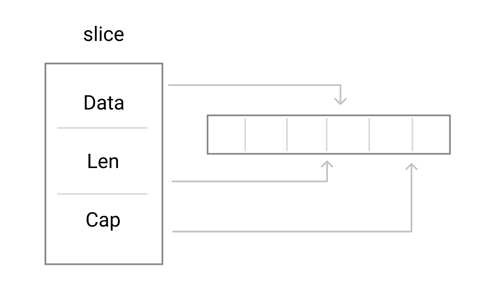
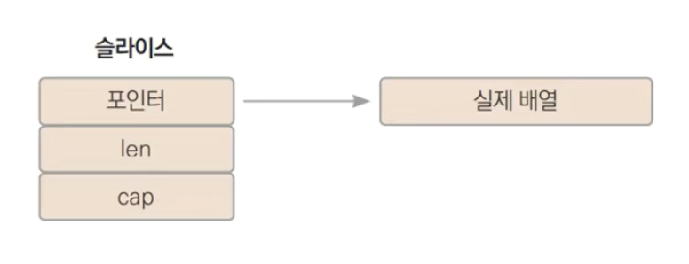

## Arrays 

미리 말하자면 Go에서는 Arrays를 잘 사용하지 않음. 의아하겠지만 **Arrays** 말고 **Slices** 사용을 Go에서도 권장함

배열은 지정된 형식의 메모리를 만들 때 유용하며 할당을 피하는 데 도움이 될 수 있지만, 주로 Slices(아래 8번째 섹션)을 구성하는 Block으로 사용 됨. 


``` go
var nums [5]int
days := [3]string{"a", "b", "c"}
var temps [5]float64 = [5]float64{24.3, 26.1}
```


**선언 개수는 항상 상수**

``` go
const x = 5
y := 3

[x]int{1, 2, 3, 4, 5} // OK
[y]int{1, 2, 3}				// ERROR
```


**index 지정 초기화**

``` go
var s = [5]int{1:10, 3:30}  // [0 10 0 30 0]
```


**데이터 크기에 따라 초기화**

``` go
x := [...]int{10, 20, 30}  // [10 20 30]
```

`[...]int{10, 20, 30}` 와 ` []int{10, 20, 30}` 는 아예 다름

전자는 정적 배열 <small>Arrays</small> 이고, 후자는 동적 배열 <small>Slices</small> 임


### 배열 순회

``` go
nums := [...]int{10, 20, 30, 40, 50}
nums[2] = 300

// 크기 기준
for i := 0; i < len(nums); i++ {
  print(nums[i])
}

// range keyword - i: index, v: value
var t [5]float64 = [5]float64{24.0, 25.9, 26.4, 23.5, 29.3}
for i, v := range t {
  print(i, v)
}
```


**배열은 연속된 메모리**

Type은 메모리의 크기

요소 위치 = 배열 시작 주소 + (인덱스 x 타입크기)


### Go Arrays VS C Array s

✔️ Go에서 배열은 **값** 👉🏻 하나의 Arrays를 다른 Arrays에 할당하면 **모든 요소가 복사**된다.

✔️ 특히, 배열을 함수에 전달하면 해당 함수에 대한 **포인터가 아니라 배열의 복사본**을 받게 되니 주의

✔️배열의 크기는 배열 타입의 일부 👉🏻 `[10]int`와 `[20]int` 유형은 서로 다름.


**Value**로 전달되는 건 유용할 수도 있지만 비용이 많이 들 수도 있음. 

만약 효율성을 높이기 위해 C의 배열처럼 사용하고 싶다면 포인터를 전달할 수 있음.  👉🏻 근데 비추. Slices 참고

```
func Sum(a *[3]float64) (sum float64) {
    for _, v := range *a {
        sum += v
    }
    return
}

array := [...]float64{7.0, 8.5, 9.1}
x := Sum(&array)  // Note the explicit address-of operator
```


## Slices

슬라이스는 배열을 래핑하여 Data sequences에 보편적이고 강력하며 편리한 인터페이스를 제공. 

Go에서는 Array를 특정 경우(변환 행렬과 같이 규격이 필요한 경우...)를 제외하고 대부분 Slices를 사용.


슬라이스는 기본 배열에 대한 참조값을 보관.

한 슬라이스를 다른 슬라이스에 할당하는 경우 둘 다 동일한 배열을 나타낸다.


동적 배열? 정확히는 **배열을 가리키는 포인터**.




### Slices의 동작원리

``` go
type SliceHeader struce {
  Data uintptr		// 실제 배열을 가리키는 포인터
  Len int					// 요소 개수
  Cap int					// capacity. 실제 배열의 길이. 최대 용량을 나타냄.
}
```


**len() & cap()**

`len(s)` : slices 의 길이

`cap(s)` : slices 의 용량

용량은 아래에서 자세히 확인!


배열의 첫 번째 요소를 가리키는 포인터 + slice의 길이 + slice의 용량




### 초기화

``` go
slice := []int{1, 2, 3}

if len(slice) == 0 {
  print("slice is empty", slice)
}

slice := []int
slice[1] = 10 // ERROR 크기가 0인데 1에 접근
```


#### index 지정

``` go
slice := []int{1: 30, 3:20, 6:10}	// [0 30 0 20 0 0 10]
```


#### make([]T, len, cap)

***func make([]T, len, cap) []T***


``` go
b := make([]int, 0, 5) // len(b)=0, cap(b)=5

b = b[:cap(b)] // len(b)=5, cap(b)=5
b = b[1:] // len(b)=4, cap(b)=4
```


### 요소 추가

#### append([]T, ...T) ⭐️

***func append(s []T, x ...T) []T***


``` go
s = append(s, 3, 12)		// 새로운 slice를 생성해서 넘김
s1 = append(s1, s2...)
```

기존 슬라이스가 바뀔 수도 있고 아닐 수도 있음. 

⭐️ **cap** 에 따라 달라짐


**빈 공간이 충분한가?**

YES : 빈 공간에 요소 추가

NO : 새로운 배열 할당 → 복사 → 요소 추가


``` go
s := make([]int, 0, 3)
for i := 0; i < 5; i++ {
    s = append(s, i)
    fmt.Printf("cap %v, len %v, %p\n", cap(s), len(s), s)
}

/* result
cap 3, len 1, 0x1040e130
cap 3, len 2, 0x1040e130
cap 3, len 3, 0x1040e130
cap 6, len 4, 0x10432220
cap 6, len 5, 0x10432220
*/
```


**⭐️ append() 의 return -> 기존 배열 or 새로운 배열**

``` go
package main

import (
    "fmt"
)

func main() {

	s := make([]int, 0, 3)
	s = append(s, 10, 20)

	s1 := append(s, 30)
	s2 := append(s, 30, 40)

	PrintSlice(s)
	PrintSlice(s1)
	PrintSlice(s2)
}

func PrintSlice (s []int) {
	fmt.Printf("%v, cap %v, len %v, %p\n", s, cap(s), len(s), s)
}

/*
[10 20]      , cap 3, len 2, 0xc0000b4000
[10 20 30]   , cap 3, len 3, 0xc0000b4000
[10 20 30 40], cap 6, len 4, 0xc0000aa090

s 는 s1은 동일 (cap보다 작기 때문에 기존의 배열에 추가)
s 는 s2은 다름 (cap보다 커지기 때문에 새로운 배열 생성) 
*/
```


**⭐️ append() 의 return -> 기존 배열 or 새로운 배열 - 함수**

``` go
func addNum(slice []int) {
  slice = append(slice, 4)
}

func addNumPtr(slice *[]int) {
  *slice = append(*slice, 4)
}

func addNumReturn(slice []int) []int {
  slice = append(slice, 4)
  return slice
}

func main() {
  slice := []int{1, 2, 3}			// len(3), cap(3)
  addNum(slice)								// slice는 변경되지 않음

  addNumPtr(&slice)				  	// slice 변경하는 방법 1
  slice = addNumReturn(slice)	// slice 변경하는 방법 2
  
  fmt.PrintLn(slice)
}
```


#### 기존 배열을 이용한 새로운 배열

``` go
s := []int{1, 2, 3, 4, 5}

// 1. 가변인자를 사용 (처음엔 가독성 떨어짐)
s1 := append([]int{}, s...)

// 2. make-copy를 사용 (길지만 목적이 분명하게 보임)
s2 := make([]int, len(s))
copy(s2, s)

// 3. for문으로 대입 (길어)
s2 := make([]int, len(s))
for i , v := range s {
  s2[i] = v
}
```


### 슬라이싱

**⭐️ Slices의 슬라이싱은 복사가 아니라 참조**

``` go
arr := []int{1, 2, 3, 4, 5}
sc := arr[1:2]					// sc는 [2]

// slicing으로 만들면 reference값으로 서로의 값을 변경하게 됨
arr[1] = 100						// sc는 [100]
sc = append(sc, 500)	// arr는 [1 100 500 4 5]
```


**slice를 슬라이싱을 할 때에는 기존의 Arrays의 크기를 본다.**

``` go
arr := []int{1, 2, 3, 4, 5}
sc := arr[1:10]
sc2 := sc[2:99] 		// sc는 10까지만 slicing했지만 원래 배열의 크기를 보기때문에 에러가 나지 않음.
```


### 요소 삭제

``` go
slice = append(slice[:idx], slice[idx+1:]...)
```


### 요소 추가

``` go
slice = append(slice[:idx], append([]int, slice[idx:]...)...)
```

중간에 메모리 한 번 더 씀.


``` go
slice = append(slice, 0)		// 맨 뒤에 요소 추가 (len 맞추기 ~)
copy(slice[idx+1:], slice[idx:]) // 값 복사
slice[idx] = 100						// 값 변경
```


### 요소 정렬

``` go
slice := []int{5, 2, 4, 7, 1}
sort.Ints(slice)
```


