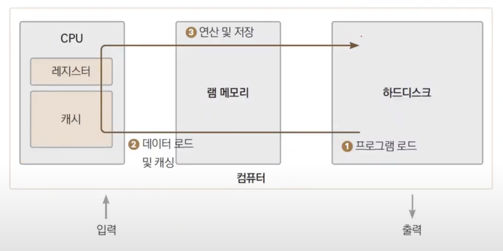

# Tucker의 Go 언어 프로그래밍


### 컴퓨터 원리 1

<small>🔗 <a href="https://youtu.be/CIyLurz-Ius">1장 컴퓨터원리 1/2</a></small>


#### 트랜지스터 

<small>Transfer + Resistor = Transistor</small>

✔️ 주 원요가 Silicon -> Si 규소! 저렴하고 작음  

✔️ **n/p/n** 형으로 제작되어 있어 p<small>(base)</small>에 전압을 가했는가에 따라 전류 흐름을 제어할 수 있음. 👉🏻 **스위치 역할** : 꺼졌을 때0과 켜졌을 때1를 나눌 수 있고, Bit라고 해서 사용

✔️ 반도체 : 도체(전류가 흐르는 물질)도 되고 부도체(전류가 흐르지 않는 물질)도 되는 물질


#### 논리소자 

<small>AND, OR, XOR, NOT</small>

**예시 ) XOR**

| 입력 1 | 입력 2 | 출력 |
| ------ | ------ | ---- |
| 0      | 0      | 0    |
| 0      | 1      | 1    |
| 1      | 0      | 1    |
| 1      | 1      | 0    |

<small>같은 입력이 들어오면 0, 다른 입력이면 1인 형태</small>


**예시 ) NOT**

| 입력 1 | 출력 |
| ---- | ---- |
| 0      | 1    |
| 1      | 0    |


이 논리소자를 통해 **가산, 감산, 곱셈, 나눗셈**이 가능한 계산기를 제작할 수 있음.
하지만 컴퓨터는 더 많은 작업들을 함. 어떻게 컴퓨터를 만들 수 있었을까.


---

### 컴퓨터 원리 2

<small>🔗 <a href="https://youtu.be/NeqFCBzeXI4">1장 컴퓨터원리 2/2</a></small>


#### 프로그램

정해진 연산을 정해진 순서대로 실행하는 것. 명령을 적은 문서.


**튜링머신** : 명령이 적힌 종이 다발(프로그램) + 한 칸씩 옮겨가며 명령을 수행하는 기계(중앙처리장치)

**폰 노이만 구조** : 


한 줄의 명령을 읽는다. 명령을 수행한다. 다음 줄로 전진한다. 

결국 컴퓨터는 아래의 세 단계를 계속해서 반복하는 것.


#### 프로그램 동작 구조





실행 (명령 다발, 실행 파일) : OS가 실행파일을 메모리로 LOAD(적재). 데이터를 copy해서 캐시로 올림. 메모리에서 데이터들을 가져와서 연산을 수행할 때 레지스터에서 수행. 이 때 데이터를 가져올 때 그 근방의 데이터들을 같이 가져오는데, 캐시의 지역성(locality) 때문. 덕분에 캐시 미스(Fault)를 줄여주고 연산이 조금 빨라짐.


**프로그램 실행을 요리로 비교** 

닭요리를 할거임. 레시피(프로그램)를 보며 요리를 진행함. 마트(하드디스크)에서 사오는 건 가장 느림. 냉장고(메모리)는 마트보다 가까워서 속도가 좀 더 빠르다. 닭을 꺼내올 때 그 주변의 마늘이랑 양파나 무같은 재료를 가져와서 용기(캐시)에 담아둠. 도마(레지스터)에서 요리사(중앙처리장치)가 실제 요리를 진행함.


---

### 프로그래밍 언어

<small>🔗 <a href="https://youtu.be/ELOihQ1HYBY">2장 프로그래밍 언어</a></small>


**정적 컴파일** : code -> 미리 기계어로 바꿈(실행파일). 실행할 때 미리 바꿔뒀기 때문에 변환 시간이 필요하지 않아 빠름 <small>C, C++, Go</small>

**동적 컴파일** : 그때 그때 기계어로 바꿈. 정적 컴파일 언어보다 느림.  <small>Java, Python</small>


**동적 컴파일은 느림에도 불구하고 왜 이후에 나왔을까?** 

정적 컴파일에 문제가 있어서겠죠. 

회사마다 OP코드가 다름. ADD라는 OP 코드가 어디는 001, 0010, 0011010이렇게 됨. 그래서 회사마다, 그리고 OS마다 다른 실행파일을 만들어줘야함.

코드만 다운받으면 실행되는 시점에 플랫폼에 따라 다르게 빌드를 해주기 때문에 어떤 컴퓨터에서든 실행을 할 수 있게 만든 것.


**근데 왜 Go가 정적 컴파일?**

근데 Go는 다시 정적 컴파일임. wow

왜 다시 돌아왔을까? 

👉🏻 **속도** 무시할 수 없기 때문에. 

👉🏻 또, 현재 **플랫폼 문제가 예전보다 많이 나아짐**. OS의 종류가 Mac os, Windos, linux 세 개 밖에 없고 모바일도 Android, iOS로 단순해졌음. 동적이라고 해도 모바일/데스크탑 코드가 다르기 때문에 어차피 다르게 만들어야 하기 때문에 이 부분은 정적과 다른 부분이 없음.

또, **Go는 환경변수만 바꾸면 플랫폼에 맞는 실행파일을 만들 수 있게 해줌**  <small>오..</small>


### go 실행

#### go run [go_file]

<small>Go 파일 실행 첫 번째 방법</small>


#### go build

<small>Go 파일 실행 두 번째 방법</small>

실행 파일 만들기 -> 1.16로 올라가면서 go module을 기본으로 하고 있음.


**go module 만들기**

``` go
go mod init [module_name]
```

`module_name`: 아무 이름이나 해도 되지만 보통 폴더 명과 동일하게 씀.


모듈을 만들고 `go build`를 하게 되면 실행 파일 생성


**package <package_name>**

코드가 속한 패키지를 명시. 반드시 파일의 상단에 적어주어야 함.

package이름 중 **main**은 **프로그램 시작점을 포함하는 패키지**라는 특별한 의미의 패키지 명. 


프로그램이 로드될 때, 프로그램을 로드했을 때 어디서부터 시작할지를 표시.

프로그램 **staring point**<small>(프로그램이 로드될 때 가장 윗 부분부터 실행 될 필요는 없음. 프로그램이 로드될 때 어느 지점부터 시작할지를 표시한 것 )</small>를 설정을 가지고 있는 패키지임.


---

### Hello Go World

<small>🔗 <a href="https://youtu.be/-a63oRs38DY">3장 Hello Go World</a></small>

Go언어는 2009년로버트 그리스머, 롭파이크, 켄톰슨 주축하에 구글에서 만든 오픈 소스 프로그래밍 언어. <small>현재 버전 1.16.2</small>


**켄 톰프슨** : C언어의 모체인 B언어를 만든 분 ->그래서 Go가 C언어와 비슷한 부분이 있음.

**롭파이크** : UTF-8인 문자 인코딩을 만드분 -> 그래서 Go의 기본 문자 인코딩이 UTF-8. (ANSI 가 문자 하나를 1Byte를 사용하지만, 유니코드는 2Byte로 사용. UTF-8도 유니코드 ~ )


#### Go의 특징

**클래스** ❌ : 클래스는 없지만, 메서드를 가지는 구조체를 지원

**상속** ❌ 

**메서드** ⭕️ : 구조체<small>(type [name] struct {})</small>가 메서드를 가짐

**인터페이스** ⭕️ : 상속은 없지만 인터페이스는 지원

**익명 함수** ⭕️ : 함수 리터럴이라는 이름으로 제공

**가비지 컬렉터** ⭕️ : 고성능 가비지 컬렉터 제공

**포인터** ⭕️

**제네릭 프로그래밍** ❌ : C++에서는 Template이라고 하는 제네릭 프로그래밍 지원안함. 근데 이거 약간 뜨거운 감자임. 문제가 많지만 유용한 면이 많기 때문에 다음 버전에서는 추가가 된다 안된다라는 얘기가 많이 떠돌고 있음.

**네임스페이스** ❌  : 네임스페이스를 제공하지 않고, 모든 코드는 패키지 단위로 분리된다.

